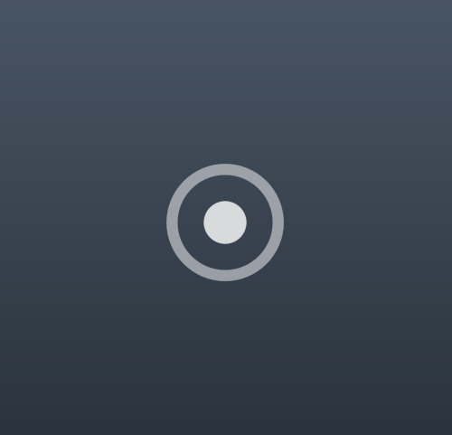
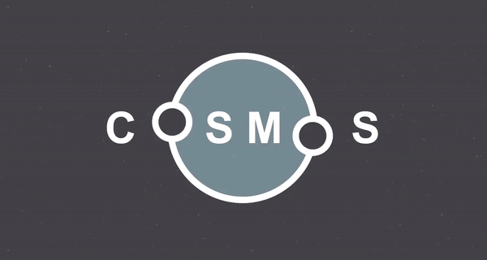
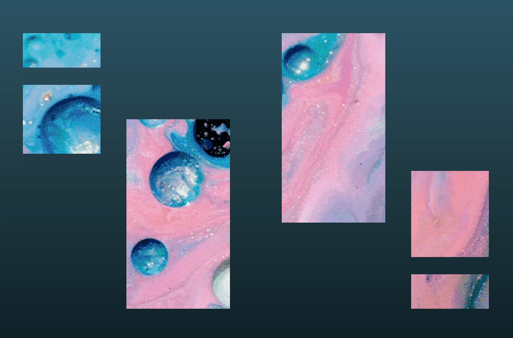

# :: Simple Sparks ::
Small projects that I think are interesting

I usually stumble upon an image, animation, or experience that leaves an impression - so here are my re-creations of those works

  

## Circle Pulse

### Features
- Built with only HTML and CSS
- A description message for screen readers
- Looks great regardless of screen size (responsive)
- Calm gradient design
- Easy customizations for speed, general size, pulse size, and color (CSS Variables)
    

## Cosmos
My re-creation of this --> [Tumblr post](http://spaceeblack.tumblr.com/post/151290842256) 

### Feautres
- Lightweight
- Easily change scale (CSS variable)
- Inspires calmness and easy breathing
- Makes a great screen saver

    

## Windows
Inspired by this --> [Web Graphics Experiments webpage](https://experiments.p5aholic.me/day/008/) 

### Features
- Looks great regardless of screen size (responsive)
- Explores writing svg paths
- Easy to change background gif (src on single img tag)

    

## 3 Towers
Re-creation of this --> [Ssal](https://fromdusttominimal.tumblr.com/post/184204864668/ssal)  
Presented by: [From Dust to Minimal](https://fromdusttominimal.tumblr.com/) 
Found on: [Tumblr](https://www.tumblr.com/)

### Features
- Minimalist

